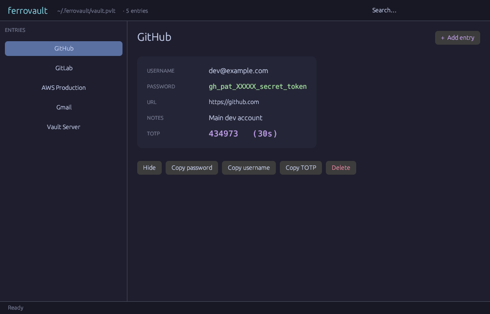
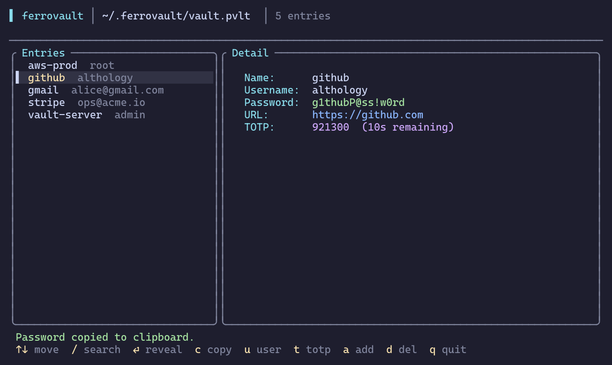
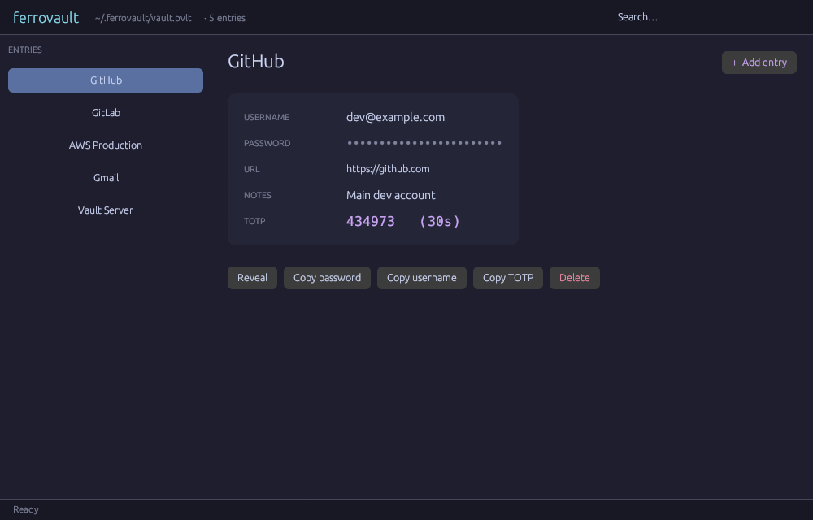
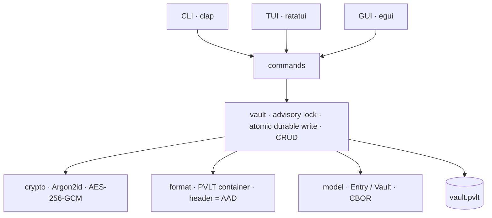
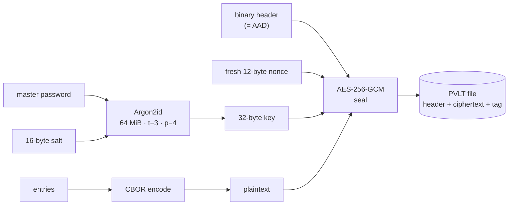
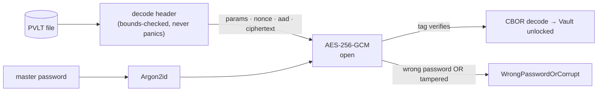

<div align="center">

# 🔐 ferrovault

### An encrypted password manager in Rust — one master password, one vault file, applied cryptography done right.

[](https://github.com/Athology0000/ferrovault/actions/workflows/ci.yml)
[](LICENSE)
[](https://www.rust-lang.org)
[](https://en.wikipedia.org/wiki/Argon2)
[](https://en.wikipedia.org/wiki/Galois/Counter_Mode)

**`CLI`**  ·  **`TUI`**  ·  **`GUI`** — three interfaces, one encrypted core. No cloud. No telemetry. No trust required.



</div>

---

## Why it's interesting

ferrovault is a **security tool built like one** — every layer is a deliberate, defensible choice, and the design is honest about its limits.

- 🔑 **Argon2id + AES-256-GCM** — memory-hard key derivation (64 MiB) feeding authenticated encryption with a fresh nonce on every write.
- 📦 **A custom `PVLT` binary format** whose header is bound as GCM associated data — a parameter-downgrade or header edit breaks decryption. The parser is bounds-checked and provably panic-free on hostile input.
- 🧹 **Secrets zeroized from memory** (master password, derived key, decrypted entries) — best-effort, and the threat model says so plainly.
- 💾 **Atomic, durable, lock-guarded writes** — a crash never leaves a half-written vault; concurrent processes can't corrupt it.
- ⏱️ **Built-in TOTP** (RFC 6238) and **HIBP breach checking** via k-anonymity — only a 5-character hash prefix ever leaves your machine.
- 🖥️ **Three interfaces from one library** — a scriptable CLI, a sleek terminal UI, and a desktop GUI, switchable with one setting.
- ✅ **39 tests**, `clippy -D warnings` clean, pure-Rust dependency graph (no `ring`/C on Windows & macOS).

---

## Three ways to use it

`ferrovault config ui tui|gui` picks the default; `ferrovault ui` launches it.

<table>
<tr>
<td width="50%" align="center"><b>Terminal UI</b> — <code>ferrovault ui</code><br></td>
<td width="50%" align="center"><b>Desktop GUI</b> — <code>ferrovault ui --gui</code><br></td>
</tr>
</table>

Both are searchable, masked-by-default, and show live TOTP codes with copy-to-clipboard (auto-clearing).

---

## Quick start

```sh
cargo build --release

# Use a throwaway path so nothing touches your real vault
ferrovault --vault ./demo.pvlt init
ferrovault --vault ./demo.pvlt add github --generate --totp <base32-seed>
ferrovault --vault ./demo.pvlt ui          # launch the TUI
ferrovault --vault ./demo.pvlt get github --copy
ferrovault --vault ./demo.pvlt check github
```

The master password is **never a CLI flag** — only hidden interactive prompts, because flags leak into shell history and process listings.

### Commands

| Command | Behavior |
|---|---|
| `init` | Create a new empty vault (prompts for the master password twice). |
| `add <name>` | Add an entry; `--generate` for a random password, `--totp <secret>` to attach a 2FA seed. |
| `get <name>` | Show one entry; `--copy` copies the password to the clipboard with auto-clear. |
| `list` · `delete <name>` | List entry names (never passwords) · remove an entry. |
| `gen [length]` | Generate a strong password (no vault needed). |
| `change-password` | Rotate the master password — re-encrypt under a fresh salt + current KDF params. |
| `totp <name>` · `check [name]` | Live TOTP code · HIBP breach check (k-anonymity). |
| `ui` · `config ui <tui\|gui>` | Launch the chosen UI · set the default. |

---

## Security design

| Property | Mechanism |
|---|---|
| Key derivation | **Argon2id** (m=64 MiB, t=3, p=4), 16-byte OS-CSPRNG salt; parameters stored in the header and auto-upgraded over time |
| Encryption | **AES-256-GCM**; fresh random 12-byte nonce per write (nonce reuse is catastrophic — a tested invariant) |
| Header binding | The full binary header is GCM **associated data** — tampering or a parameter downgrade breaks authentication |
| Format | Custom binary **`PVLT`** container; plaintext is **CBOR** (compact, no base64); bounds-checked parser |
| Secret handling | Master password, derived key, decrypted contents wrapped in `Zeroizing<_>` |
| Durability | temp → `fsync` → atomic `rename` → dir `fsync`; advisory cross-platform lock across the read-modify-write |
| Breach check | k-anonymity — only the first 5 hex chars of the SHA-1 leave the machine |

Wrong password and a tampered file are **indistinguishable** by design (both → one error). See **[`docs/threat-model.md`](docs/threat-model.md)** for what it defends against and what it explicitly does **not**, and **[`docs/code-walkthrough.md`](docs/code-walkthrough.md)** for a guided tour of the crypto/format/vault internals.

---

## Architecture

A library crate holds all logic; a thin binary parses args and dispatches. Each module has one responsibility and is independently tested. The three UIs share one encrypted core — only `vault` touches the disk.



## How encryption works

The **write path** — derive a key, serialize, seal, and bind the header as authenticated data:



The **read path** is fail-closed — a wrong password and a tampered file are cryptographically **indistinguishable**, so both surface as one error:



## Build & test

```sh
cargo test                              # 39 tests
cargo clippy --all-targets -- -D warnings
cargo fmt --all -- --check
```

Rust stable. **Windows & macOS** need no C toolchain (OS-native TLS). **Linux** links system OpenSSL (`libssl-dev` / `openssl-devel`).

---

## Attribution

An independent, from-scratch implementation. The feature scope was inspired by the `foundations/password-manager` project in [`CarterPerez-dev/Cybersecurity-Projects`](https://github.com/CarterPerez-dev/Cybersecurity-Projects) (AGPL-3.0) — **no code, tests, or data files were copied**. Standards (Argon2id, AES-GCM, RFC 6238, HIBP) were implemented against their primary specifications. Released under the [MIT License](LICENSE). See [`ATTRIBUTION.md`](ATTRIBUTION.md).
